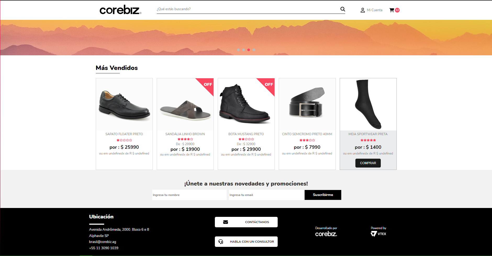
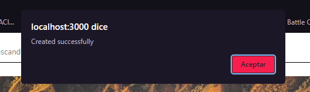

# Prueba tecnica Front End Corebiz 2022

- [Instalar y Correr la aplicación](#instalar-y-correr-la-aplicación)
- [Descripción de la solución](#descripción-de-la-solución)

## Instalar y Correr la aplicación

- Las únicas herramientas que utilicé para la prueba fueron el CLI "create-react-app" y "npm" para ejectuar el start del proyecto (el último puede ser añadido con la instalación de [Node](https://nodejs.org/es/download/)).

Instalar create-react-app : `npm install -g create-react-app`
Instalar npm : `npm install -g create-react-app`

- Una vez ubicado en la carpeta `root` de la aplicacion únicamente se corre el comando: `npm start`. El comando ejecutará la aplicación en el modo de desarrollo y solo tiene que abrir [http://localhost:3000](http://localhost:3000) para ver el entorno en su navegador.

## Descripción de la solución

- El consumo de la api para los productos se lleva a cabo dentro del componente `<ProductDisplayPage/>` que representa el Shelf de los artículos. Cada producto capturado por la petición es almacenado en un array de productos con la ayuda de un state para poder iterarlo con un map, el cual mandará la data a un componente (`<ProductItem/>`) para representar cada uno de los productSummary.

- Para el registro al Newsletter hice uso del elemento `<form>` dentro del componente `<Newsletter/>`, por lo que las validaciones dentro de los inputs están dadas por :
    - Es necesario colocar información en ambos inputs para realizar el submit.
    - El input para email es de tipo email, por lo que es necesario incluir un "@" dentro del campo.
    - Al momento de hacer click en el botón de "Suscribirme" se realiza el POST mostrando en consola y mediante un "alert" la respuesta obtenida si no se presenta un error, o solo un mensaje dentro de consola de lo contrario.

 - El slider de productos simular una transición entre una serie de banners.

 

 Saludos cordiales!
 Elaboró: Rosas Maganda Ricardo